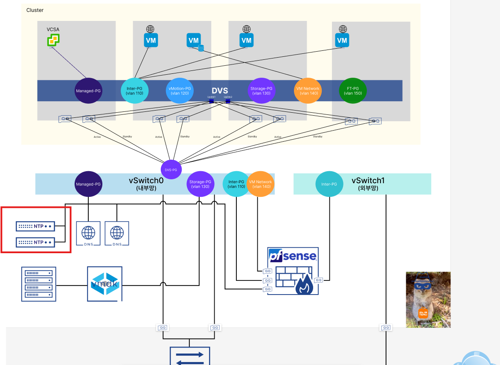
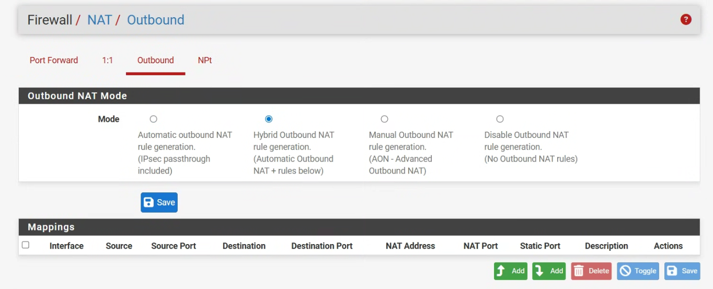
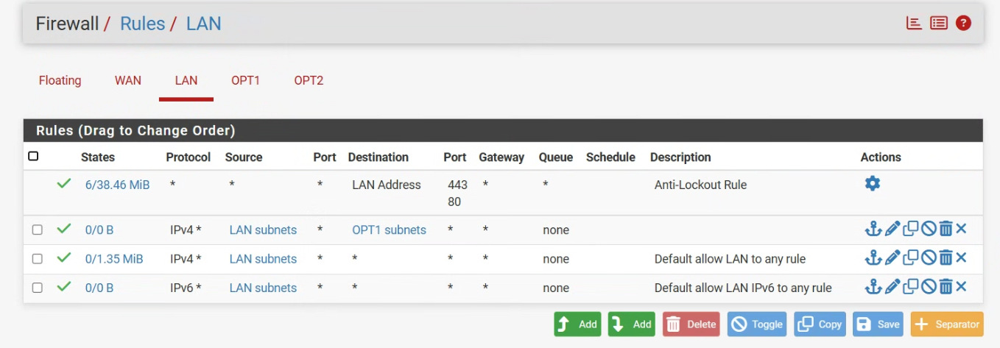
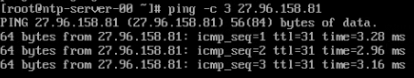
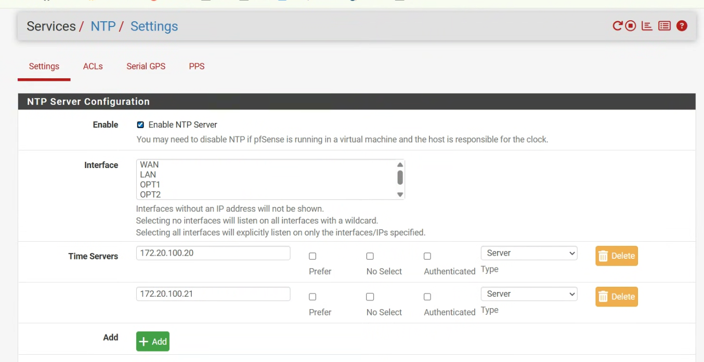
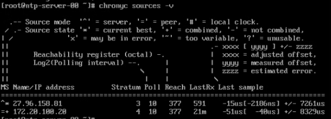
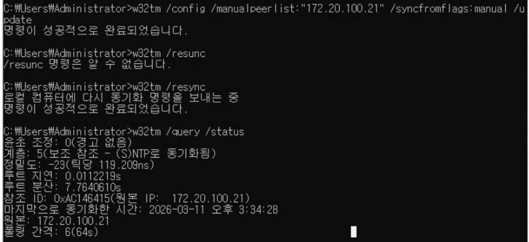

# NTP 서버 구축

## 1. 목적

금융/증권 시스템의 RDBMS 및 vSphere 클러스터 환경에서는 서버 간 **0.1초 수준의 시간 오차**만 발생해도 다음과 같은 문제가 생길 수 있다.

- 트랜잭션 순서가 꼬여 데이터 정합성에 문제가 발생할 수 있음
- vSphere의 **HA**, **vMotion** 등의 고가용성 기능이 오작동할 수 있음

따라서 외부 표준시를 받아와 내부망에 배포하는 **전용 NTP 서버 구축**은 안정적인 인프라 운영을 위한 필수 조건임.


## 2. 구성도 / 개념

### 구성 개념

- NTP 서버는 **물리 ESXi 내부의 독립된 VM**으로 구성하여 관리
- **Managed 대역**에서만 접근 가능하도록 설정
- 외부 표준시(KRISS)와 동기화하기 위해 **외부망과 연결**
- NTP 이중화를 위해 **서버 간 피어링(Peering)** 구성
- 물리 서버 내 모든 VM은 NTP 서버로부터 시간을 받아가는 **클라이언트** 역할 수행

### 전체 구조



### 전체 흐름

- 외부 표준시(KRISS) → NTP 서버
- NTP 서버 간 Peer 동기화 → 이중화
- 내부 VM / pfSense / Windows DNS 서버 → NTP 서버로 시간 동기화


## 3. 사전 준비사항, 설치, 설정 절차

### 3-1. 사전 준비사항

#### NTP VM 사양

- vCPU: 1 Core
- RAM: 1GB
- Disk: 16GB (Thin Provisioning)
- 네트워크 어댑터: `vSwitch0`의 `Managed-PG`
- OS: **Rocky Linux Minimal**
- Gateway: `172.20.100.254`
- DNS Server: `8.8.8.8` (임시)
- 적재 위치: 물리 ESXi (`172.20.100.1`)

#### 서버 IP 정보

- NTP 0: `172.20.100.20/24`
- NTP 1: `172.20.100.21/24`

> 원문에는 NTP 0과 NTP 1의 IP가 동일하게 적혀 있었으나, 이후 peer 설정과 클라이언트 설정 흐름에 맞춰 NTP 1은 `172.20.100.21`로 정리함.

#### OS 선택 이유

- Alpine Linux는 초경량 OS로 자원 효율성, 부팅 속도, 보안성 측면에서 장점이 있음
- 그러나 표준 Linux와 다른 명령어를 사용하는 경우가 많아 운영 일관성이 떨어질 수 있음
- 따라서 다른 서버들과의 **운영 통일성**을 고려하여 **Rocky Linux**를 선택함

---

### 3-2. NTP VM 서버 생성 및 네트워크 설정

#### IP 할당

```bash
sudo nmtui
systemctl restart NetworkManager
ip a
```
---

### 3-3. NTP 서버 관련 방화벽 설정
#### 아웃바운드 NAT 설정

- 물리 스위치는 NTP 서버가 위치한 LAN 대역을 직접 알지 못하므로, pfSense가 NTP 서버의 출발지 주소를 자신의 외부용 IP로 변환하여 외부망으로 전달해야 함.



- 경로: Firewall > NAT > Outbound

- 설정 방식: Hybrid 또는 Manual로 변경

#### Rule 설정 (방화벽 규칙 개방)

- pfSense는 기본적으로 안에서 밖으로 나가는 트래픽도 제한될 수 있으므로, NTP 서버가 외부 KRISS 서버와 통신할 수 있도록 규칙을 허용해야 함.

- 트래픽 흐름
> NTP → Switch0 → pfSense → Switch1 → Internet → Switch1 → pfSense → Switch0 → NTP



- 첫 번째 규칙: LAN 네트워크에서 pfSense로 들어오는 트래픽 허용

- 세 번째 규칙: LAN에서 외부로 나가는 트래픽 허용

- IPv4 기반 상위 프로토콜 허용

    - TCP, UDP, ICMP 등 포함

- NTP는 UDP 기반이므로 해당 흐름이 통과 가능해야 함

#### NTP 서버로 들어오는 규칙이 별도로 필요 없는 이유

- pfSense는 stateful firewall

- 내부 → 외부 요청을 허용하면, 해당 요청에 대한 응답 패킷은 자동 허용

- 따라서 NTP 서버에 대한 별도의 인바운드 규칙 없이도 정상 동작 가능

---

### 3-4. KRISS 서버와 통신 확인


- 방화벽 및 NAT 설정 이후 KRISS 서버와의 연결 여부를 확인.

- KRISS 서버 IP: 27.96.158.91

---

### 3-5. NTP 서버 설정 (KRISS 연동, 서버 이중화, Client 제공)
#### Chrony 설치
```bash
sudo dnf install -y chrony
sudo systemctl enable --now chronyd
systemctl status chronyd
chronyc sources -v
```

- chrony 설치

- chronyd 서비스 실행 및 부팅 시 자동 시작

- 상태 및 동기화 정보 확인

#### /etc/chrony.conf 설정
```bash
sudo vi /etc/chrony.conf
server 27.96.158.81 iburst
peer 172.20.100.21

allow 10.40.0.0/16
allow 172.20.100.0/24
allow 192.168.0.0/24
```
 - server 27.96.158.81 iburst: 외부 표준시(KRISS) 서버로부터 시간 동기화

- peer 172.20.100.21: 다른 NTP 서버와 peer를 맺어 이중화

- allow 10.40.0.0/16: VM Network, Inter-PG 대역 클라이언트 허용

- allow 172.20.100.0/24: Managed-PG 대역 클라이언트 허용

- allow 192.168.0.0/24: pfSense WAN 대역 클라이언트 허용

- NTP 1에서는 peer 대상을 반대로 172.20.100.20으로 설정

#### Rocky Linux 자체 방화벽 개방
```bash
firewall-cmd --permanent --add-service=ntp
firewall-cmd --reload

systemctl restart chronyd
systemctl enable chronyd
```

- OS 자체 방화벽에서 NTP 서비스 허용

- Chrony 재시작 및 부팅 시 자동 시작 등록

---

### 3-6. NTP 클라이언트 설정
#### pfSense


- 경로: Services > NTP > Settings

- 내부 NTP 서버 IP 등록

#### Windows DNS 서버
```bash
w32tm /config /manualpeerlist:"172.20.100.20 172.20.100.21" /syncfromflags:manual /update
w32tm /resync
w32tm /query /status
```

- 내부 NTP 서버를 수동 동기화 대상으로 등록

- 즉시 재동기화 수행

- 동기화 상태 확인

---

### 3-7. 이중화 VM 클라이언트 설정

- 기존 가상 머신을 복제하여 생성

- IP 주소 변경

- chrony.conf에서 peer 대상 VM 주소를 반대로 변경

- 예시

    - NTP 0 → peer 172.20.100.21

    - NTP 1 → peer 172.20.100.20


## 4. 확인 / 검증 방법
### 4-1. NTP 서버 Kriss 동기화 상태 확인
```bash
chronyc sources -v
```


- ^* (IP주소): 현재 메인으로 동기화 중인 서버

- =+ (IP주소): 피어링된 NTP 서버, 이중화 대상

---

### 4-2. Windows 클라이언트 동기화 상태 확인
```bash
w32tm /query /status
```


- 현재 참조 중인 시간 서버 확인 가능

- 내부 NTP 서버를 통해 시간 동기화가 수행되는지 검증 가능

## 5. 트러블슈팅
### 5-1. KRISS 서버와 통신이 되지 않는 경우
#### 원인
- pfSense Outbound NAT 미설정
- 내부 → 외부 트래픽 허용 규칙 누락
- 게이트웨이 또는 DNS 설정 오류

#### 조치
- Firewall > NAT > Outbound에서 Hybrid / Manual 설정 여부 확인

- LAN → 외부 허용 규칙 재확인

- VM 네트워크 설정(ip a, gateway, DNS) 점검

---

### 5-2. chronyc sources -v에 동기화 서버가 표시되지 않는 경우
#### 원인

- NTP 서버 OS 방화벽 미개방

#### 조치

- firewall-cmd --list-all: 명령어를 통해 전체 혹은 특정 포트번호에 대해 Rocky Linux 자체 방화벽 허용


## 6. 참고사항

- 금융/가상화 환경에서는 시간 동기화가 단순 편의 기능이 아니라 서비스 안정성의 핵심 요소

- NTP 서버는 단일 서버보다 이중화 + 피어링 구조가 안정적

- 운영 환경에서는 외부 공개 DNS(8.8.8.8) 대신 내부 정책에 맞는 DNS 사용 권장

- KRISS 서버 IP 및 정책은 운영 환경에 따라 달라질 수 있으므로 실제 환경 기준인 위성 GPS 기반임을 인지하기!